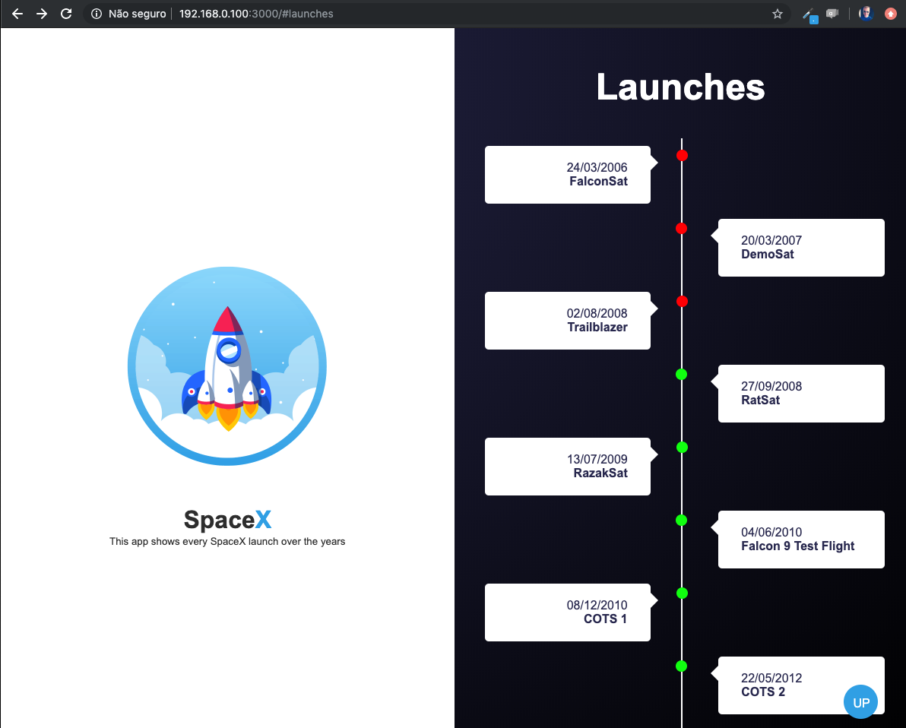

# SpaceX 
This application consumes spaceX API and show every single lounch over the year.
It's just a simple application to teach myself React and GraphQL.

## Clone app
After clone the app, run the command below inside the main folder in terminal to download packages:
```javascript
yarn
```

## Starting Server
To star backend server, in the **main** folder, run the command bellow in terminal
```javascript
yarn dev
```

To star the client, get in **client** folder and run the following command in terminal
```javascript
yarn start
```

Visiting the url bellow, you shold now see
```html
http://localhost:3000
```



